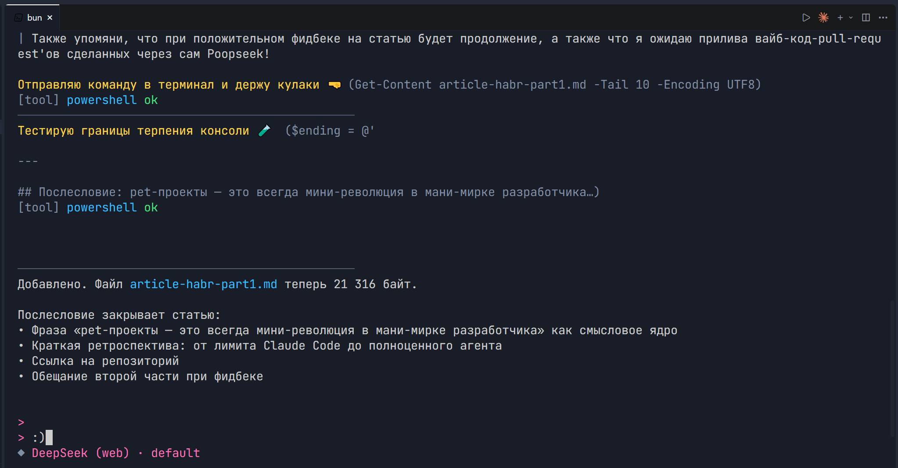

# Меня достали лимиты Claude Code, и я написал свой. Встречайте PoopSeek

> Или как я перестал быть параноиком, выкинул кредитку в окно и подружил DeepSeek с терминалом.

***

## Пролог: точка невозврата

Знаете это чувство, когда Claude Code в четвёртый раз за день говорит вам «извини, твоя сессия исчерпана, приходи завтра, а лучше послезавтра»? Я знаю. Это чувство примерно как когда вы уже раскочегарили сложный рефакторинг, модель на полпути переписала вам полпроекта, и тут — бах. Лимит. Досвидос. 50% кодовой базы в состоянии квантовой суперпозиции между «работало» и «компилируется». Прекрасно.

И тут меня осенило. DeepSeek бесплатный. Но есть нюанс — официальное платное API это одно, а бесплатный чат-интерфейс на **chat.deepseek.com** — совсем другое. Никакого SDK под чат-версию не существует. Есть только браузерная версия, которая вообще не планировалась как публичное API. Но под капотом там всё то же самое — function calling, стриминг, 64K контекст. Просто чтобы до него достучаться, нужно воспроизвести всю механику браузера: proof-of-work рукопожатие (криптографическая задачка, которую DeepSeek требует решить перед установкой сессии), управление сессиями через conversation ID, parent message ID для цепочки ответов. Готовых библиотек — ноль. Что ж, сказал я себе. Значит будет свой провайдер. Свой HTTP-клиент с нуля. Свой WASM-модуль для криптографических вычислений. Свой потоковый парсер ответов. С чистого листа — зато полностью под контролем, без лимитов, без ключей, без кредитки. Правильно. Свой AI-агент в терминале с полным доступом к файловой системе.

> \[Иллюстрация 1]   —  Скриншот активной сессии PoopSeek: цветной промпт   `>`, агент выполняет несколько tool calls подряд (bash, file.write, agent.ask). Видна цепочка reasoning-комментариев между шагами, индикатор генерации пульсирует в статус-строке. Крупно: «Агент сам решает что делать. Ты просто смотришь.»

## Рождение имени

Название родилось само:   Poop   + DeepppSeekpp = PoopSeek. Нет, это не то, о чём вы подумали. «Poop» — потому что проект начался как буквально «накидал по-быстрому на коленке, пока кофе не остыл». Знаете этот жанр pet-проектов, когда ты такой «сейчас быстро набросаю прототип» — и через три недели у тебя 200+ коммитов, архитектура как у небольшого стартапа, и ты объясняешь жене, почему в три ночи ты всё ещё «почти закончил».

Так PoopSeek и стал моим ночным проектом, который внезапно перерос во что-то настоящее. Сейчас: TypeScript 5+, Bun-рантайм, 135+ файлов исходного кода, три внешние зависимости, и одна очень уставшая от лимитов Claude Code мотивация.

***

## Архитектура: что под капотом

Прежде чем погружаться в фичи, давайте серьёзно. Потому что архитектура здесь это что-то большее чем "склепал на скорую руку". Когда у вас агент, который может выполнять shell-команды, модифицировать файлы и спавнить дочерние AI-сессии, проектировать нужно ответственно.

### Стек

```
Runtime:     Bun (Bun.spawn, Bun.file, нативный TS)
Язык:        TypeScript 5+, strict mode
Терминал:    terminal-kit (markdown, цвета, темы)
AI:          OpenAI SDK + кастомный DeepSeek HTTP-клиент + Anthropic SDK
MCP:         @modelcontextprotocol/sdk 1.29.0 (STDIO + HTTP)
```

Всего три внешних пакета. Никаких фреймворков, никаких «установи 200 МБ ради кнопки». Стандартная библиотека делает 90% работы.

### Модульная карта

```
src/
├── agent/              # Цикл принятия решений, парсинг tool calls, контекст
│   ├── loop.ts                   # Классический цикл с batching
│   ├── streaming-loop.ts         # Стриминговый цикл (тулы парсятся на лету)
│   ├── streaming-tool-parser.ts  # Потоковый парсер JSON из чанков
│   ├── tool-call-parser.ts       # Пакетный парсер для полных ответов
│   ├── tool-executor.ts          # Единый диспетчер с JSON Schema валидацией
│   ├── sub-agent.ts              # Раннер изолированных суб-агентов
│   └── context-manager.ts        # Окно сообщений, токен-трекинг, refresh
│
├── providers/          # Мульти-провайдерная система
│   ├── deepseek-web.ts    # Кастомный клиент DeepSeek (бесплатный веб-API)
│   ├── openai-compat.ts   # OpenAI-совместимые (OpenRouter, Ollama, LM Studio etc.)
│   ├── anthropic.ts       # Claude API (пока не тестировалось)
│   └── gemini.ts          # Google Gemini API (и оно тоже)
│
├── deepseek-client/    # Глубокая интеграция
│   ├── DeepseekClient.ts  # Сессии, стриминг
│   ├── PowService.ts      # Proof-of-Work рукопожатие (защита API)
│   └── WasmService.ts     # WASM-вычисления для PoW
│
├── tools/              # 23 инструмента агента
│   ├── defs/              # bash, powershell, file.*, git, git.edit,
│   │                      #   memory.*, todo.*, user.*, agent.*, skill.read
│   └── index.ts           # Статический реестр
│
├── commands/       # Слеш-команды CLI (21 штука — /skills, /refactor, /mcp...)
├── mcp/            # Model Context Protocol (авто-обнаружение, менеджер, типы)
├── cli/            # Терминальный интерфейс (главный цикл, онбординг, сессии)
├── skills/         # Менеджер навыков (49+ директорий-источников)
├── bridge/         # Потоковый мост deepseek-stream
└── variables/      # Подстановка {{variable}} в промптах
```

> \[Иллюстрация 2]   —  Архитектурная диаграмма: в центре Agent Loop, от него лучи к Tools, Providers, MCP Manager, Skills Manager, CLI Layer. Цветовое кодирование: зелёное — агент, синее — инструменты, оранжевое — провайдеры, фиолетовое — MCP. Подпись: «Никакой магии — двенадцать модулей с четкой ответственностью.»

### Два режима агента

Важное архитектурное решение — не один цикл, а два.

Классический

&#x20;(`loop.ts`) — модель генерирует полный ответ, парсер извлекает tool calls постфактум, они выполняются батчем, результаты возвращаются. До 256 шагов за ход.

Стриминговый

&#x20;(`streaming-loop.ts`) — модель стримит ответ частями. `StreamingToolParser` вылавливает завершённые JSON-блоки (` ```json ... ``` `) прямо из потока, не дожидаясь конца генерации. Инструмент уходит на выполнение мгновенно, даже если модель ещё продолжает генерировать текст.

Разница на практике: в стриминговом режиме вы видите прогресс в реальном времени. Инструменты начинают работать параллельно с генерацией текста.

***

## Агент изнутри: как это работает

### Agent Loop — главный конвейер

1. Пользователь вводит запрос
2. ContextManager   склеивает промпт: системный базовый промпт + JSON Schema всех инструментов + история диалога + новый ввод
3. Вызывается LLM-провайдер — модель возвращает текст + tool call блоки в JSON
4. Парсер   режет ответ: текст → рендерится пользователю как markdown, инструменты → в ToolExecutor
5. ToolExecutor   валидирует аргументы по JSON Schema, выполняет в изоляции рабочей директории, возвращает `{ ok, output, error, data }`
6. Результаты возвращаются модели — агент видит что вышло и решает, нужен ли следующий шаг
7. Повторять до 256 раз

Параллельно: до 10 инструментов за шаг (20 в режиме рефакторинга). Модель может в одном ответе вернуть сразу `file.read`, `bash`, и `file.edit` — и все три выполнятся одновременно.

### Reasoning на виду

DeepSeek имеет режим рассуждения, модель "думает про себя" перед ответом. PoopSeek фильтрует эти токены и показывает в терминале как строчки комментариев:

```
> ℹ Модель: Надо прочитать файл с типами, понять какие поля не используются...
🔨 Выполняется: file.read [src/tools/types.ts]
✓ Готово (127 строк)

> ℹ Модель: Вижу три неиспользуемых поля. Меняю через file.edit...
🔨 Выполняется: file.edit [src/tools/types.ts]
✓ Готово
```

Вы читаете ход мыслей агента в реальном времени. Это не лог-файл — это часть интерфейса.

> \[Иллюстрация 3]   —  Терминал с включённым reasoning. Текстовые блоки модели выделены серым курсивом, tool calls с цветными иконками (🔨 bash, 📄 file.read, 💾 file.write, 🧠 agent.ask). Статус-строка: шаг 3/256. Подпись: «Reasoning как комментарий: видишь ход мыслей модели перед каждым действием.»

### Batching: почему 256 шагов это не шутка

В ранних версиях было 10 шагов за ход. Потом 12. Сейчас — 256. Но магия не в числе.

Раньше модель вызывала инструменты по одному: ответ → tool call → выполнение → следующий ответ. Медленно, особенно когда нужно прочитать 3 файла.

Теперь модель возвращает батч. Парсер извлекает все вызовы из ответа (*fenced JSON блоки*), и они уходят на выполнение одновременно. Стриминговый парсер идёт дальше — выцепляет готовые блоки прямо во время стриминга. Лимит `maxToolsPerStep` (10, в рефакторинге 20) предотвращает runaway — чтобы модель не спавнила 50 параллельных bash-команд в припадке усердия приводя в припадок сердце 😉.

### Context Manager — чтобы агент не забыл кто он такой

Окно сообщений — 30 последних (настраивается). Каждое проходит через `estimateApproxTokens()` — грубая оценка: длина строки / 4 = примерное число токенов.

При накоплении \~64,000 токенов ContextManager автоматически впрыскивает   refresh-снапшот  :

- Кто я (PoopSeek, AI-агент)
- Где я нахожусь (рабочая директория)
- Какие инструменты доступны (краткий список)
- О чём был разговор (ключевые факты)

Это не классический "summarize and continue", а легковесное напоминание - модель не теряет нить, но получает якорь в контексте. CLI отображает "контекст обновлён" в статус-строке.

***

## Инструменты: 23 рычага вместо восьми

Когда я начинал, инструментов было 8: шесть файловых, bash и tools.list. Сейчас их 23.

### Файловая система

- `file.read` / `file.write` — атомарная запись через temp-file + rename (защита от краша на середине записи)
- `file.edit` — точечная замена строки с валидацией точного совпадения
- `file.list` / `file.remove` / `file.find` — листинг, удаление, рекурсивный поиск по glob

### Shell и Git

- `bash` / `powershell` — выполнение команд, вывод возвращается агенту
- `git` / `git.edit` — любые git-команды + программное применение unified diff без вызова `git apply`

### Память и задачи

- `memory.save` / `memory.read` / `memory.list` — key-value хранилище в `.poopseek/memory/` с namespace и TTL
- `todo.write` / `todo.read` — персистентный todo-лист в `.poopseek/todo.json`

### Суб-агенты (киллер-фича)

- `agent.ask` — делегировать вопрос суб-агенту с указанием файлов и JSON-схемы ответа
- `agent.parallel` — запустить N суб-агентов параллельно, дождаться всех, агрегировать

### Интерактивность

- `user.ask` / `user.confirm` / `user.choice` — агент может спросить пользователя посреди работы

### Мета

- `tools.list` — рефлексия: агент видит чем располагает
- `skill.read` — прочитать тело любого skill-файла

> \[Иллюстрация 4]   —  Схема параллельной работы суб-агентов: основной Agent Loop в центре, от него 5 стрелок к SubAgent 1..5, под каждым указаны файлы (handlers/auth.ts, handlers/user.ts...), справа результат в виде JSON-отчёта. Подпись: «agent.parallel: 5 файлов за время одного. Основной агент только агрегирует.»

### Суб-агенты в деталях

Это не просто «попроси модель ответить». Архитектура суб-агентов продумана:

- Изоляция:   суб-агент получает только содержимое переданных файлов и instruction — он не видит историю основного диалога
- Без инструментов:   суб-агент не может писать файлы или выполнять shell — он только анализирует и возвращает JSON
- Строгий контракт:   промпт суб-агенту начинается с «Respond ONLY with a single JSON object wrapped in a `json` block»
- Парсинг с восстановлением:   `extractJson()` поддерживает fenced и bare-object форматы, плюс лёгкий ремонт битых JSON
- Провайдерская гибкость:   суб-агенты используют `provider.clone()` — чистая сессия с теми же параметрами что у основного агента

Представьте задачу "проверь все 20 файлов в папке handlers на типовые ошибки". Без суб-агентов: 20 последовательных чтений и анализов — 20 раундтрипов. С `agent.parallel`: 5 суб-агентов по 4 файла, все одновременно, 5 структурированных JSON-отчётов аггрегируются в сводку. Время — как для одного раундтрипа.

---

## In the end
### Pet-проекты — это всегда мини-революция в мани-мирке разработчика

Вдумайтесь: всё началось с того, что меня в очередной раз оборвали на полуслове. А закончилось полноценным AI-агентом с 23 инструментами, параллельными суб-агентами, мульти-провайдерной системой и авто-обнаружением MCP-серверов. Не потому что я гениальный архитектор, а потому что лимиты Claude Code стали той самой точкой кипения, после которой ты либо сдаёшься и платишь, либо садишься и пишешь своё.

Pet-проекты это чистая вода. Никто не говорит тебе "это слишком сложно", "это не влезет в спринт", "давай в следующем квартале". Ты просто берёшь и делаешь. Вечер. Ночь. Утро. Три внешних пакета. И инструмент, который теперь работает на тебя, а не наоборот.

---

**PoopSeek** цветёт и пахнет. И распространяется, как и его запашок через open-source. 


Лежит здесь: **[github.com/Aver005/poopseek](https://github.com/Aver005/poopseek)**. Клонируйте, пробуйте, ломайте, чините. Если понравилась статья — дайте знать. При хорошем фидбеке напишу вторую часть: как устроен стриминговый парсер, как MCP-серверы заводятся без конфигов, и почему атомарная запись в файл спасла мне Code Review не один раз.

И да. Я жду ваших пулл-реквестов. Особенно если они написаны через сам PoopSeek. Представьте: AI-агент, который контрибьютит в код своего же проекта. Если это не определение вайб-кодинга, то я не знаю что такое вайб-кодинг.

---

*PoopSeek: потому что лучший AI-ассистент — тот, который не просит у тебя денег.*
